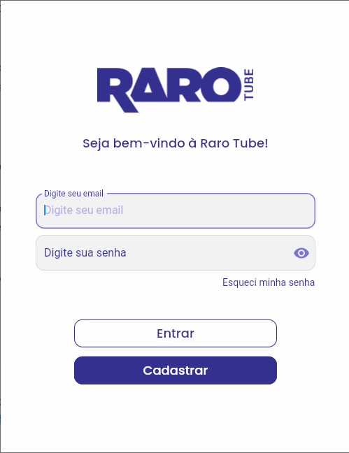

# Rarguile

 <a href="#description">Descrição</a> •
 <a href="#funcionalidades">Funcionalidades</a> • 
 <a href="#usodoprojeto">Uso do Projeto</a> • 
 <a href="#autores">Autores</a>

 

## **Descrição**

> O projeto **Rarguile** foi criado na intenção de facilitar a vida de nossos usuários em relação aos seus estudos voltados para a empresa **Raro Academy**.

## **Funcionalidades**

> O aplicativo permite a exibição das vídeos aulas de acordo com cada turma, desta forma, o usuário pode **criar conta**,**recuperar senha**, **assistir suas aulas**, **favoritar seus vídeos** assim como **comentar** o mesmo.

 

## **Uso do Projeto**

> Assim que o aplicativo é iniciado, o usuário será redirecionado para a parte de visitantes, aonde irá poder assistir vídeos disponibilizados para o usuário conhecer. Ao reparar, na parte da Appbar, terá um botão que permite o usuário ir para a tela de login, aonde ele poderá realizar a entrada do App e consultar vídeos especializados para sua turma.

 

## **Suporte e Autores do Projeto**

> Para poder entrar em contato com um de nossos desenvolvedores.

- [Luis de Napoli](https://www.linkedin.com/in/luisnapoli/)
- [Claudevânio de Jesus](https://www.linkedin.com/in/claudev%C3%A2nio-de-jesus-7a1a90216/)
- [Franklyn Viana dos Santos](https://www.linkedin.com/in/franklyn-viana-dos-santos-553314169/)

   

<h4 align="center"> 🚧 Projeto em construção... 🚧 </h4>
<!-- #RarGuile

<b>Olá Nobres guerreiros!</b>

Aqui estamos chegando na nossa finalização de uma grande etapa de nossas vidas, fico extremamente feliz em saber que meus companheiros
irão me acompanhar nesta última aventura de nossa dungeon chamada " Raro Academy ", vamos enfrentar este desafio juntos, e realizar nosso
sonho de entrar no mercado de Dev!

Lembrando caros guerreiros, em nosso atual mundo <a href="https://gitlab.com/thak1996/rarguile">GitLab do projeto</a>, temos uma
observação constante de deuses em nosso mundo: GustaDev, Kaio, Marco, Cristian e Bebeto. Façam uso constante das Issues, lutaremos de forma Magnifica(Codando claro) e reinaremos neste Novo Mundo!

Tutoriais Básicos:  
Realizei a criação de Issues para trabalharmos! Para está situação, seguiremos da seguinte forma:

- Abrir página principal do <a href="https://gitlab.com/thak1996/rarguile">projeto</a>
- Na esquerda, terá um botão de Issues -> Ao passar o mouse, ele irá exibir uma janela com opções -> Selecione "Painéis" 
  Irá exibir uma nova tela, nesta tela teremos painéis como: To do,To dev, Code Review, Testes e Done.  
  OBS: Eu Franklyn, irei criar as Issues para serem criadas. Caso queira criar, sinta-se a vontade, me consulte para entender o funcionamento.  
- To do  
  Esta parte, nada mais é do que a lista de issues que temos a fazer.
- To dev  
  Esta parte nada mais é do que as Issues em desenvolvimento pelos participantes do grupo!
- Code Review  
  Está é uma das partes mais chatas, será feita a verificação do código.
- Testes  
  Está parte é simples, aonde será feito os testes relacionados a implementação da feature que o Code Review está verificando.
- Done  
  Esta parte é simples também! É a parte aonde foi feito todos os processos para ser liberado a solicitação do Pull Request/Merge

Agora que Todas as listas estão bem explicativas, irei agora explicar nosso uso diário, durante todo o processo de desenvolvimento
do nosso projeto, irei adicionar Issues relacionadas as coisas que temos para fazer no To Do, desta forma, caso queira " Pegar esta tarefa ",
dê um clique único em cima da Issue, será aberto uma tela do lado direito, está tela irá te informar detalhes sobre a issue, procure por
" Responsável " e selecione " Atribuir a mim ", caso você comece a tarefa, clique na Issue e arraste para To Dev, caso tenha finalizado, mova para Code Review, e na parte de Code Review para frente, será feito por outra pessoa, aonde seu código será verificado, testado e movido para a done caso tudo tenha dado certo! Mas esteja atento, caso seu código esteja incorreto, será atribuida uma nova etiqueta " Reprovado " e será retornada novamente para To Dev!

Mantenha seus Pull e Push sempre em dia, e Mãos a Obra!

OBS: Estou ciente que iremos recriar nosso Readme.me para apresentar o projeto, mas vamos deixar assim por enquanto para auxiliar nossa equipe -->
